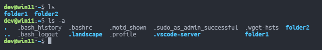
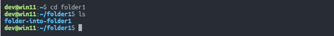
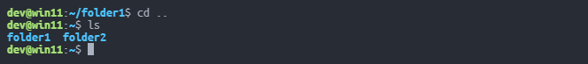
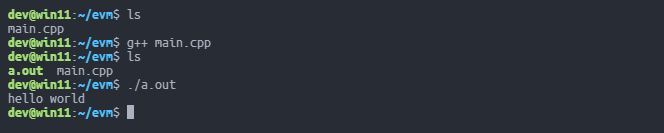
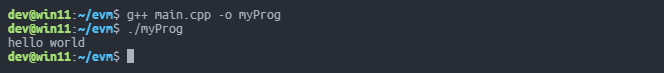

# Минимальный набор для работы с терминалом

Терминал (или консоль - называйте как удобнее) позволяет попросить компьютер выполнить какое-то действие печатая на клавиатуре специальные команды.

## Файловая система

В обычной жизни мы все умеем смотреть содержимое папок, открывать их двойным кликом, возвращаться к предыдущим и так далее. Как делать то же самое в терминале?

### Посмотреть содержимое текущей папки

```bash
ls
```

Не все файлы и папки будут видны. Если их имя начинается с **.** (точки), то они будут скрытыми и не отобразятся. Обходится это при помощи **ключа** `-a`. **Ключи** представляют собой дополнительные параметры, с которыми можно запустить команду или программу. Они начинаются со знака **-**. Некоторые ключи имеют более понятную форму и начинаются с **--**, например для `-a` это `--all` - работать будет одинаково. В итоге команда примет вид:

```bash
ls -a
```



### Перейти в папку

Видно, что в текущей папке (это папка пользователя **~**) лежат еще _folder1_ и _folder2_, перейти в первую из них при помощи `cd` можно выполнив:

```bash
cd folder1
```

Между **:** и **$** изменится путь в соответствии с совершенным переходом.



В выводе `ls -a` всегда есть "странные" папки, чьи имена **.** (точка) и **..** (две точки). **..** крайне полезна, так как позволяет "подниматься" (возвращаться) на папку назад. Вернемся обратно в **~** выполнив:

```bash
cd ..
```



**.** это текущая папка. Если написать `cd .`, то ничего не произойдет - переход будет сделан в ту же папку, откуда и была вызвана команда. Тем не менее **.** приходится в дальнейшем.

> Создания файлов и папок не будет, потому что это можно делать используя файловые менеджеры с графическим интерфейсом, например Nautilus. Используя [VSCode + WSL] можно открыть в code папку пользователя **~**, запускающийся интегрированный терминал будет работать из неё. Задачи же, допустим, будут лежать глубже, в **~/evm** и далее для каждой задачи в своей папке **~/evm/task-1**, **~/evm/task-2**, etc. Чтобы перейти в терминале из **~** в папки с кодом задачи и нужно использовать `cd`.

## C/C++

Чтобы запустить **программу**, необходимо получить исполняемый файл из файлов с кодом. Самый простой вариант, когда код программы состоит из одного файла. Тогда компилятор `gcc` вызывается:

```bash
gcc main.c
```

вместо _main.c_ может быть любой файл с кодом программы, внутри которого есть функция **main**.

Для C++ во избежание проблем стоит писать:

```bash
g++ main.cpp
```

выполнение такой команды создает файл _a.out_, можно увидеть его, вызвав `ls`.

Запустить этот файл и посмотреть что произойдет можно так (понадобится та самая точка):

```bash
./a.out
```



Если имя по умолчанию _a.out_ не устраивает и исполняемый файл должен называться иначе, то можно использовать ключ `-o` таким образом:

```bash
g++ main.cpp -o filename
```

И запустить соответственно:

```bash
./filename
```

На самом деле в Linux нет привычных расширений (.txt, .cpp, и так далее), они нужны только для удобства, поэтому _filename_ может быть, скажем, "myProg"



После `./filename` (или `./a.out`, если не меняли имя) через пробел можно указывать различные параметры, если программа способна их обрабатывать, например `./a.out 100 5 3`. Они будут передаваться как аргументы функции **main**, если она написана как:

```cpp
int main(int argc, char** argv) {
    ...
}
```

Причем количество аргументов (**argc**) будет не меньше 1, а нулевым аргументом массива **argv** (т.е. `argv[0]`) будет имя исполняемого файла.

## Полезные вещи

Чтобы очистить вывод терминала не обязательно его закрывать и открывать снова, достаточно написать

```bash
clear
```

Многие команды или, что важно, имена файлов, не обязательно писать полностью самостоятельно - нажав на <kbd>Tab</kbd> терминал попробует дополнить ввод. Например, если в папке только один файл _a.out_ и больше никаких файлов начинающихся на _a_ нет, то достаточно написать `./a`, нажать <kbd>Tab</kbd> и всё допишется само. Поэтому старайтесь давать понятные, пускай и длинные, имена папкам и файлам, ибо писать их полностью вам всё равно не придётся.

Не обязательно все команды писать каждый раз заново, если вы один раз что-то ввели, то нажимая <kbd>&uarr;</kbd> и <kbd>&darr;</kbd> можно получить их и исполнить еще раз.

При выполнении `./a.out`, программа возвращала в терминал строку "hello world" и он её печатал. Этот вывод можно _перенаправить_ в файл при помощи `>`.

```bash
./a.out > output.txt
```

Если файла, чье имя указано, не существовало, то он автоматически будет создан, это, в частности, способ создать пустой файл, надо только написать `> filename`.

Функция полезна если вывод программы сохранить надо, но самостоятельно создавать файл, копировать текст из терминала и затем вставлять в файл может быть лень.

Для копирования и вставки, кстати, может понадобиться использовать непривычное сочетание клавиш <kbd>Ctrl</kbd>+<kbd>Shift</kbd>+<kbd>C</kbd> и <kbd>Ctrl</kbd>+<kbd>Shift</kbd>+<kbd>V</kbd> соответственно.

Сочетание <kbd>Ctrl</kbd>+<kbd>C</kbd> прерывает работу чего-то в терминале - можно использовать его если программа, например, зациклилась.

В [VScode + WSL], однако, всё работает и без <kbd>Shift</kbd>: выделенный текст копируется и вставляется, а без какого-либо выделения происходит завершение работы программ.
